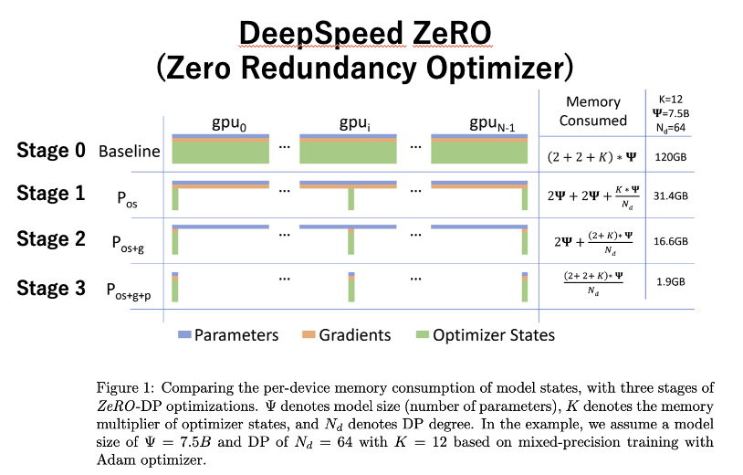

# deepspeed-tutorial-miyabi

[ZeRO: Memory Optimizations Toward Training Trillion Parameter Models](https://arxiv.org/abs/1910.02054)

# Quick Start : DeepSpeed Zero-2
Zero-2 is most popular method.

Setting
- Task: Classification (1000 class)
- Dataset: ImageNet train data (1,281,167 images)
- Training Model: ResNet50 (full scratch)
- Epoch: 1
- Batch size: 10,000
- GH200: 2node 2 GPUs

## Edit config before training
> [!NOTE]
> You only need to edit this file for the code to run.

- `configs/default.yaml` : Parameter setting
- `.env` : Environment variables

> [!WARNING] 
> You must edit below 3 points.

- Row 9,17 and 20 in `configs/default.yaml`: 
    - 9: `YOUR_WANDB_ACCOUNT_NAME`
    - 17 and 20: `YOUR_ABCI_ACCOUNT_NAME`

- First row in `.env` , set your working directory as environment variable `$PATH_TO_WORKING_DIR` .
    - 1: `PATH_TO/deepspeed-abci-tutorial`

## Environment Set Up
```
git clone https://github.com/matsuolab/deepspeed-abci-tutorial.git
```
Create virtual environment: work
```
source scripts/import-env.sh .env
```
```
cd $PATH_TO_WORKING_DIR 
```
```
module load python/3.11/3.11.9 cuda/11.7/11.7.1 cudnn/8.9/8.9.7 hpcx-mt/2.12
```
```
python3 -m venv work
```
```
source work/bin/activate
```
```
pip3 install -r requirements.txt
```
```
deactivate
```

## Multinode Training on 9 node 36 V100 GPUs 
```
cd $PATH_TO_WORKING_DIR 
```
```
qsub -g gcb50389 scripts/train.sh
```
then you can see training log
```
cat tutorial.oxxxxx
```
Like this-> [tutorial.o42638672](./docs/tutorial.o42638672)

The GPUs you are using are recorded in the following file. This file is necessary for inter-node communication on ABCI.
```
cat hostfile_xxxxx
```
Like this-> [hostfile_42638672](./docs/hostfile_42638672)

## Evaluate on single V100 GPU
This is just check we can load weight into single GPU. So only few images is used to eval. 
```
cd $PATH_TO_WORKING_DIR 
```
```
qsub -g gcb50389 scripts/eval.sh
``` 


> [!TIP]
> # How does DeepSpeed work?


## DeepSpeed Zero-0 (Stage0)
- 基本的な分散トレーニング: DDP(Data Disctibuted Parallel)
- モデルパラメータ、勾配、オプティマイザの状態がすべてのGPUで複製される
- メモリ効率は低いが、実装が単純

## DeepSpeed Zero-1 (Stage1)
- オプティマイザの状態を分割
- 各GPUは、パラメータの一部に対応するオプティマイザの状態のみを保持
- メモリ使用量が減少し、大規模モデルのトレーニングが可能に

## DeepSpeed Zero-2 (Stage2)
- オプティマイザの状態と勾配を分割
- 各GPUは、割り当てられたパラメータに対する勾配とオプティマイザの状態のみを保持
- さらにメモリ効率が向上し、より大きなモデルや大きなバッチサイズが可能に

## DeepSpeed Zero-3 (Stage03)
- オプティマイザの状態、勾配、モデルパラメータを完全に分割
- 各GPUは、割り当てられたパラメータ、その勾配、オプティマイザの状態のみを保持
- 最大のメモリ効率を実現し、非常に大規模なモデルのトレーニングが可能
- 通信オーバーヘッドが増加するが、パラメータシェアリングなどの技術で緩和

# Reference
- [ZeRO: Memory Optimizations Toward Training Trillion Parameter Models](https://arxiv.org/abs/1910.02054)
- [DeepSpeed:深層学習の訓練と推論を劇的に高速化するフレームワーク](https://www.deepspeed.ai/assets/files/DeepSpeed_Overview_Japanese_2023Jun7th.pdf)
- [microsoft/DeepSpeedExamples/training/cifar/cifar10_deepspeed.py](https://github.com/microsoft/DeepSpeedExamples/blob/master/training/cifar/cifar10_deepspeed.py)
